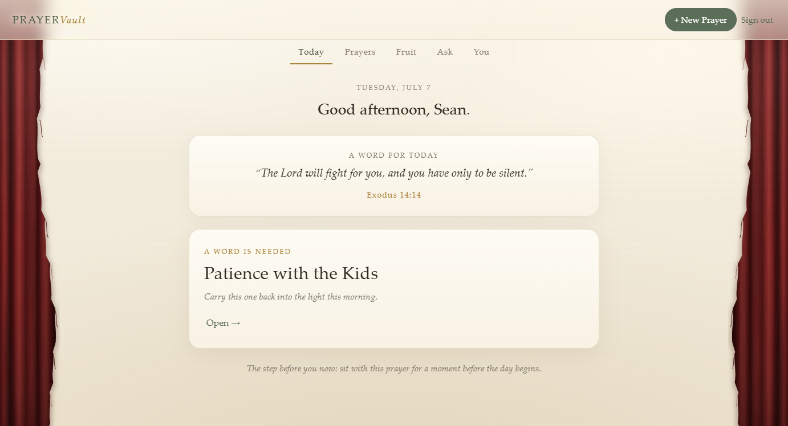
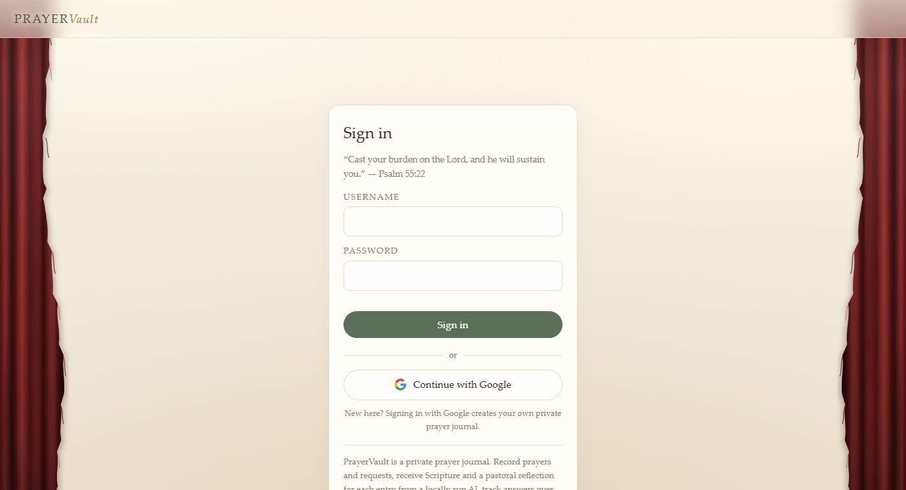
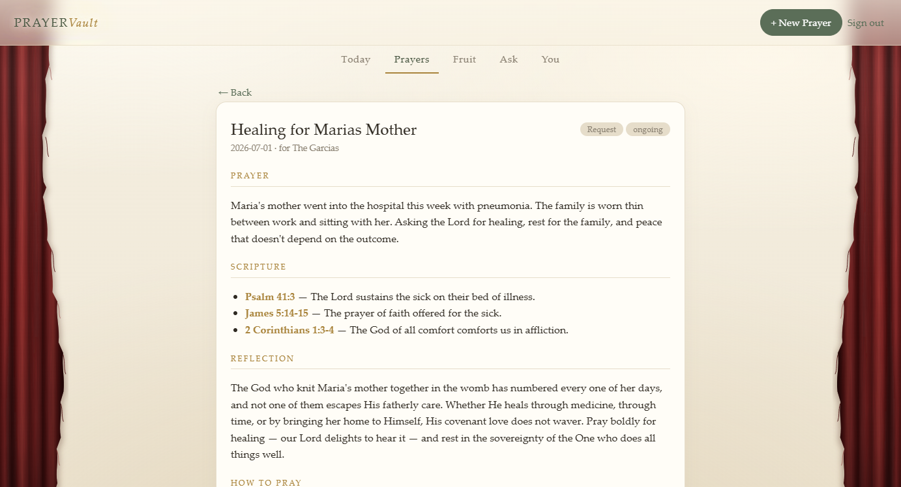
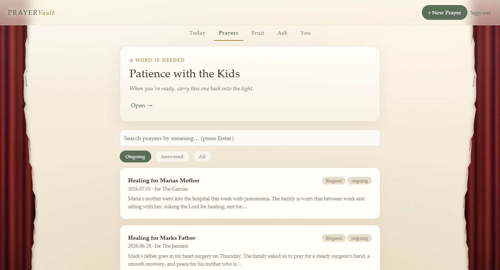
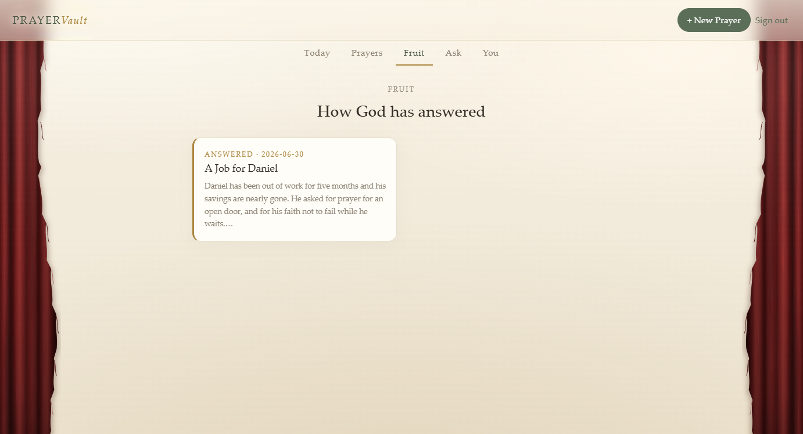
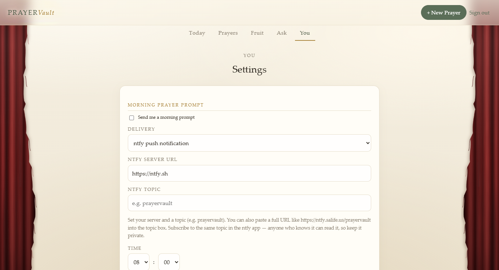

<p align="center">
  
</p>

<h1 align="center">PrayerVault</h1>

<p align="center"><em>A private, self-hosted prayer journal with a local AI chaplain's-assistant.</em></p>

PrayerVault stores prayers and prayer requests as Obsidian-flavored Markdown
notes in your own vault, and a local Ollama model responds to each entry with
relevant Scripture (linked in `[[John 1#13|John 1:13]]` vault format), a
Reformed pastoral reflection, and ACTS-style prompts for how to pray. Track
requests over time, mark them answered, and look back on the fruit. Friends and
family can sign in with Google and get their own private journals; everyone can
back up to their own Google Drive.



## Features

- **Markdown-first storage** — one `.md` file per prayer, no database. Your
  journal lives in your Obsidian vault and syncs like any other note.
- **Local AI** — Ollama on your own hardware writes the Scripture, Reflection,
  and How to Pray sections. Prayers never leave your server.
- **Requests & answers** — track who asked, add dated updates, mark prayers
  answered, and revisit them in the **Fruit** tab.
- **Ask** — Scripture Q&A against the same local model.
- **Semantic search & related prayers** — local embeddings link similar prayers
  together and power search.
- **Voice entry** — dictate prayers; a local Whisper container transcribes them.
- **Morning prompt** — optional daily push (via [ntfy](https://ntfy.sh)) with a
  verse and the prayer most in need of attention.
- **Google sign-in (optional)** — others get their own private journal in a
  separate folder; your vault is never shared.
- **Backups** — one-click zip download, plus "Back up to Google Drive" which
  uploads to the *user's own* Drive using the `drive.file` scope.
- **Installable app (PWA)** — installs on phone and desktop with its own icon.
- **No frontend dependencies** — a single HTML file and one JS file. No build
  step, no CDN, strict CSP.

## Screenshots

| Sign in | A prayer with AI response |
|---|---|
|  |  |

| Prayer list | Answered prayers |
|---|---|
|  |  |

| Settings & morning prompt |
|---|
|  |

## Architecture

- **FastAPI** backend + single-page frontend, packaged in Docker
- **Storage**: your Obsidian vault for the admin; per-user folders under
  `USERS_DIR` for Google users (one `.md` note per prayer — no database)
- **AI**: Ollama (chat + embeddings), Whisper for speech-to-text — all local
- **Auth**: bcrypt password login for the admin + optional Google OAuth for
  everyone else; signed HttpOnly session cookies, login rate limiting,
  per-user AI rate limiting, security headers

## Quick start (Docker)

1. Copy `.env.example` to `.env`.
2. Generate a password hash: `python scripts/hash_password.py` → paste into `.env`.
3. Generate a session secret: `python -c "import secrets; print(secrets.token_hex(32))"` → paste into `.env`.
4. Set `PRAYERS_DIR` to the vault folder prayers should live in.
5. Set `OLLAMA_MODEL` to a model you have pulled (`ollama list`), or let the
   bundled ollama container pull one on first start.
6. `docker compose up -d --build`

### Exposure options

- **Public (HTTPS)** — point a DNS record at your IP, set `DOMAIN` in `.env`,
  forward ports 80/443. Caddy handles certificates automatically.
- **Cloudflare Tunnel (recommended for NAS)** — use `docker-compose.nas.yml`:
  no port forwarding, no exposed IP. Create a tunnel in Cloudflare Zero Trust,
  set `TUNNEL_TOKEN`, and add a public hostname pointing at `prayervault:8000`.
- **LAN-only** — expose the port mapping, set `COOKIE_SECURE=false`, browse to
  `http://<host-ip>:8800`. (Voice capture requires HTTPS or localhost.)

### Install as an app

PrayerVault is a PWA. Desktop Chrome/Edge: install icon in the address bar.
Android: Chrome menu → *Add to Home screen* → *Install*. iOS: Safari share
sheet → *Add to Home Screen*. Requires HTTPS (or localhost).

## Google sign-in + Drive backup (optional)

Leave `GOOGLE_CLIENT_ID`/`GOOGLE_CLIENT_SECRET` unset and every Google feature
stays hidden. To enable them:

1. **Create a project** at [console.cloud.google.com](https://console.cloud.google.com)
   (e.g. "PrayerVault").
2. **Enable the Google Drive API** — APIs & Services → Library → *Google
   Drive API* → Enable. (Needed for Drive backups only.)
3. **Configure the consent screen** — Google Auth Platform → Branding: app
   name, support email. Under **Audience** choose *External*. Add your domain
   under *Authorized domains*.
4. **Create the OAuth client** — Clients → Create client → *Web application*.
   Authorized redirect URI (must match exactly, watch for typos in the domain):

   ```
   https://<your-domain>/api/auth/google/callback
   ```

5. **Set the env vars** — `GOOGLE_CLIENT_ID`, `GOOGLE_CLIENT_SECRET`, and
   `PUBLIC_URL=https://<your-domain>` — then redeploy.

Hard-won notes from setting this up:

- The redirect URI and `PUBLIC_URL` must agree **exactly**, character for
  character. A one-letter domain typo produces a dead redirect after consent.
- **Don't upload a logo until you're ready for verification.** A production
  app with a logo is blocked from granting new scopes until Google verifies
  your branding. Verification requires the homepage to be publicly readable,
  to state what the app does, and to link a real privacy policy and terms —
  PrayerVault's login page satisfies all three out of the box
  (`/privacy.html`, `/terms.html`).
- The `drive.file` scope is non-sensitive, so no scope verification or app
  review is needed — the app can only see backup files it created itself.
- Google users' journals land in `USERS_DIR` (the NAS compose maps a
  `user_journals` volume and chowns it for the container user automatically).
  AI usage is rate-limited to 30 calls/hour per user.

## Configuration

All config is env vars read in `app/config.py` (see `.env.example`):

| Variable | Purpose |
|---|---|
| `AUTH_USERNAME`, `AUTH_PASSWORD_HASH` | Admin login (hash via `scripts/hash_password.py`; use `AUTH_PASSWORD_HASH_B64` if `$` gets mangled) |
| `SESSION_SECRET` | Signs session cookies — generate 32 random hex bytes |
| `VAULT_DIR` | Admin's prayer folder (the Obsidian vault path in-container) |
| `USERS_DIR` | Folder for Google users' journals |
| `OLLAMA_URL`, `OLLAMA_MODEL`, `EMBED_MODEL`, `OLLAMA_TIMEOUT` | Local AI |
| `WHISPER_URL` | Speech-to-text service |
| `GOOGLE_CLIENT_ID`, `GOOGLE_CLIENT_SECRET`, `PUBLIC_URL` | Google sign-in + Drive backup |
| `COOKIE_SECURE` | `false` only for plain-HTTP LAN use |
| `NTFY_SERVER` | Self-hosted ntfy server for morning prompts |
| `PRAYERS_DIR`, `USERS_DIR_HOST`, `DOMAIN`, `TUNNEL_TOKEN`, `LAN_PORT`, `PUID`/`PGID` | Compose-level (volumes, Caddy/Cloudflare) |

The app fails fast at startup if secrets are missing. Never commit `.env`.

## Note format

```markdown
---
title: Healing for a friend
date: '2026-07-02'
type: request            # prayer | request
status: ongoing          # ongoing | answered (+ answered-date when answered)
ai: done                 # pending | done | error
tags: [prayer, prayer/request]
requested-by: The Smiths # only on requests
---

## Prayer
## Scripture       (AI) wikilinked verses + one-line "why"
## Reflection      (AI) pastoral encouragement
## How to Pray     (AI) ACTS-style prompts
## Related         (AI) wikilinks to similar prayers
## Updates         timeline: "- YYYY-MM-DD — text"
```

Notes are recognized as app-owned by the `prayer` tag; anything else in the
folder is left alone. The AI's voice is Reformed (Presbyterian, Westminster
Standards) by default and can be re-tuned from the in-app prompt editor on the
**You** tab.

## Development

```powershell
pip install -r requirements.txt pytest
pytest tests/            # runs fully offline; Ollama is mocked

# Run locally
$env:SESSION_SECRET="dev"; $env:AUTH_PASSWORD_HASH="<hash>"
$env:VAULT_DIR="C:\tmp\vault"; $env:COOKIE_SECURE="false"
uvicorn app.main:app --reload
```

Pushes to `master` build and publish `ghcr.io/s39n/prayervault:latest` via
GitHub Actions (tests must pass first).
